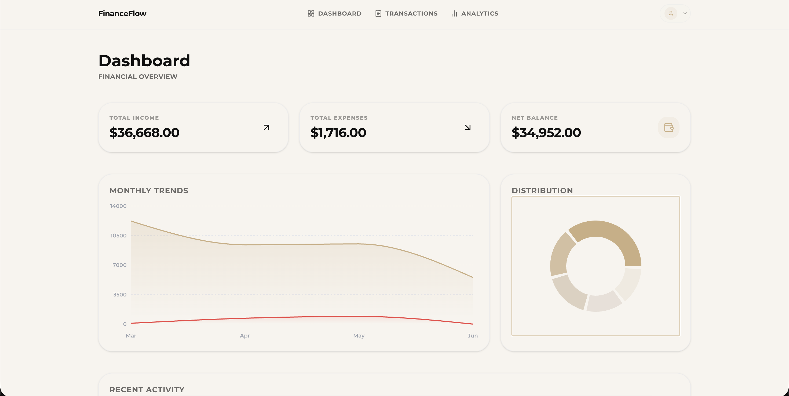
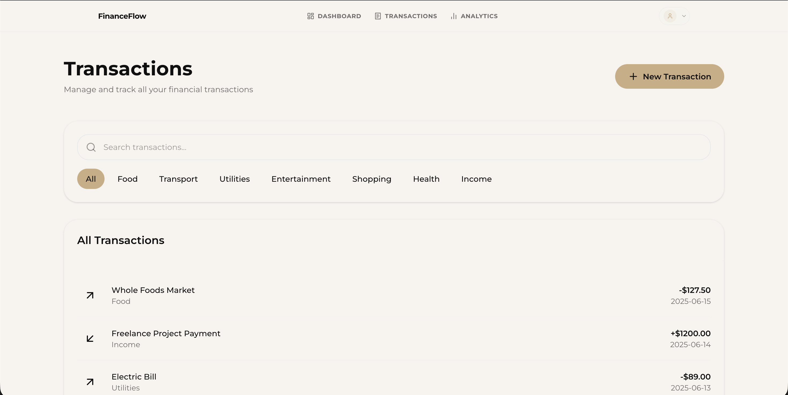
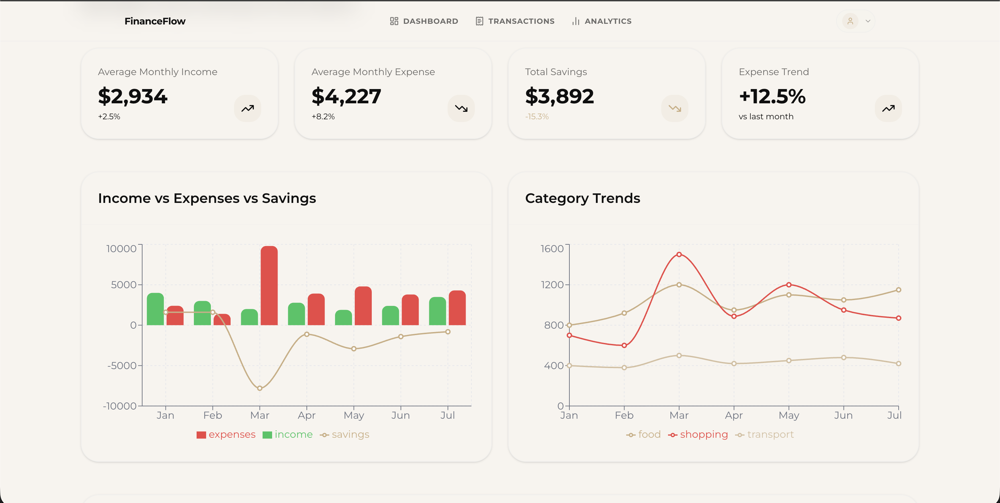
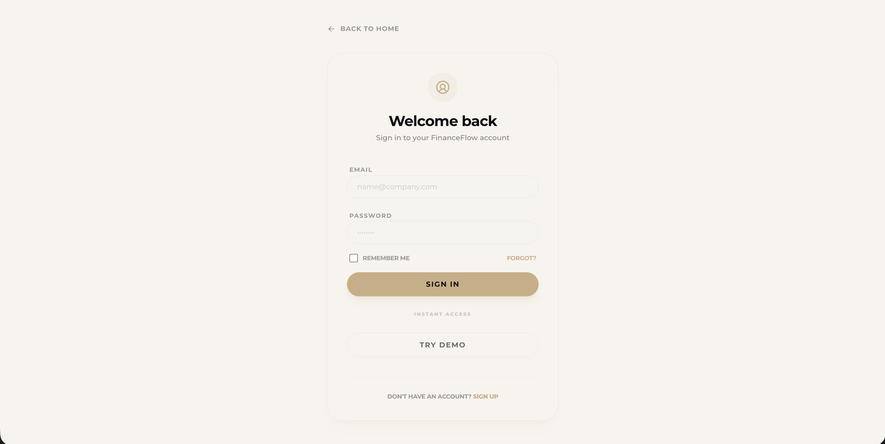

# 💰 FinanceFlow

A modern full-stack financial management platform built with **Django REST Framework** and **Next.js**, designed to help individuals and organizations track income, expenses, financial performance, and user-based access control through a secure and scalable architecture.

---

## 🚀 Live Demo

**Frontend:** `https://financeflow-fullstack.vercel.app/`

**Backend API:** `https://financeflow-fullstack-1.onrender.com`

---

## ✨ Features

### 🔐 Authentication & Role-Based Access Control

* Custom User model with **Email Authentication**
* JWT-based authentication
* Role-Based Access Control (RBAC)

  * **Admin** – Full system access
  * **Analyst** – Create and manage financial records
  * **Viewer** – Read-only access
* Protected API endpoints using custom permissions

---

### 📊 Financial Record Management

Manage all financial activities through a centralized system:

* Income & Expense tracking
* Multiple financial categories:

  * Salary
  * Freelance
  * Food
  * Transport
  * Utilities
  * Entertainment
  * Other custom categories
* Create, update, view, and archive transactions
* Soft deletion support for auditability

---

### 📝 Auditing & Data Integrity

Every financial record includes:

* Created By
* Created At
* Updated At
* Soft Delete Status

This ensures complete traceability and prevents accidental data loss.

---

### 🔍 Advanced Filtering & Search

Powerful querying capabilities powered by Django REST Framework:

* Filter by:

  * Date ranges
  * Transaction type
  * Categories
* Search transactions using notes
* Sort by:

  * Amount
  * Date
  * Creation time

---

### 📈 Interactive Dashboard

Get a quick overview of your financial health through:

* Total Income
* Total Expenses
* Balance Summary
* Recent Transactions
* Financial Activity Overview

---

### 📉 Visual Analytics

Analyze spending habits and income trends through:

* Expense breakdowns
* Income tracking
* Category-based insights
* Trend visualizations

---

### 👤 User Management

Administrative controls include:

* View all users
* Manage user roles
* Activate / deactivate accounts
* User profile management

---

### 🌱 Seed Data Support

A custom management command is included for generating sample data during development.

```bash
python manage.py seed_data
```

---

## 🛠️ Tech Stack

### Backend

* Python
* Django
* Django REST Framework
* PostgreSQL
* JWT Authentication
* Django Filter

### Frontend

* Next.js (App Router)
* React
* TypeScript
* Tailwind CSS
* Shadcn/UI
* Lucide Icons

### Deployment

* Render (Backend)
* Vercel (Frontend)
* PostgreSQL Database

---

## 📂 Project Structure

```text
finance-fullstack/
│
├── finance-dashboard-backend/
│   ├── users/
│   ├── finances/
│   ├── finance_dashboard/
│   ├── requirements.txt
│   └── manage.py
│
├── finance-dashboard-frontend/
│   ├── app/
│   ├── components/
│   ├── lib/
│   ├── public/
│   └── package.json
│
└── README.md
```

---

## ⚙️ Backend Setup

### Clone Repository

```bash
git clone https://github.com/yourusername/finance-fullstack.git
cd finance-fullstack
```

### Create Virtual Environment

```bash
python -m venv venv
```

### Activate Environment

#### Windows

```bash
venv\Scripts\activate
```

#### macOS/Linux

```bash
source venv/bin/activate
```

### Install Dependencies

```bash
pip install -r requirements.txt
```

### Configure Environment Variables

Create a `.env` file:

```env
SECRET_KEY=your-secret-key

DEBUG=True

DATABASE_URL=your-postgresql-url

ALLOWED_HOSTS=localhost,127.0.0.1
```

### Run Migrations

```bash
python manage.py migrate
```

### Create Superuser

```bash
python manage.py createsuperuser
```

### Seed Sample Data

```bash
python manage.py seed_data
```

### Start Backend Server

```bash
python manage.py runserver
```

---

## 🎨 Frontend Setup

### Install Dependencies

```bash
npm install
```

### Configure Environment Variables

Create `.env.local`

```env
NEXT_PUBLIC_API_URL=http://127.0.0.1:8000/api
```

### Start Development Server

```bash
npm run dev
```

---

## 🔑 API Capabilities

### Authentication

* User Registration
* Login
* JWT Token Refresh
* Profile Management

### Financial Records

* Create Transaction
* Update Transaction
* Delete Transaction (Soft Delete)
* View Transactions
* Filter & Search Records

### User Administration

* List Users
* Manage Roles
* Update User Status

---

## 📸 Screenshots

Add screenshots of:






---

## 🌟 Future Improvements

* Budget Planning
* Financial Goals Tracking
* Recurring Transactions
* Export to Excel/PDF
* Email Notifications
* Advanced Charts & Reports
* Multi-Currency Support

---

## 📄 License

This project is licensed under the MIT License.

---

## 👨‍💻 Author

**Shivam**

Built as a full-stack portfolio project showcasing:

* Django REST Framework
* Next.js App Router
* Authentication & Authorization
* REST API Development
* PostgreSQL Integration
* Modern Frontend Architecture
* Full-Stack Deployment
